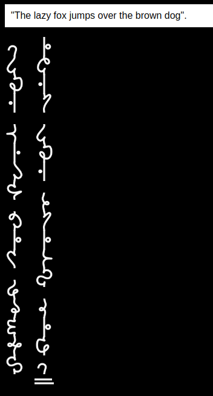
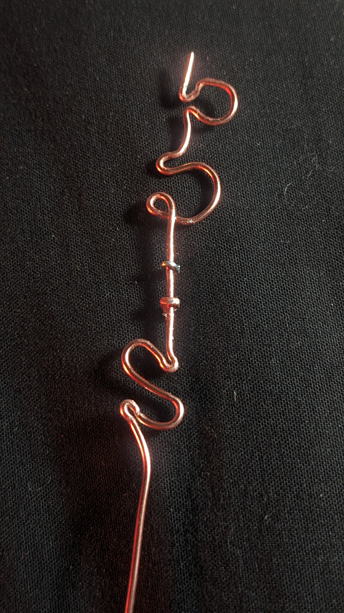

# willowscript
A small website for writing out a beautiful vertical cipher script, willowscript, by ['TheAlchemyBook'](www.tiktok.com/@thealchemybook)
[Use it here!](https://necarlson97.github.io/willowscript/)

# Work In Progress
Still needs to be done:
* Numbers!
* Options for changing question-mark styles, font size, etc
